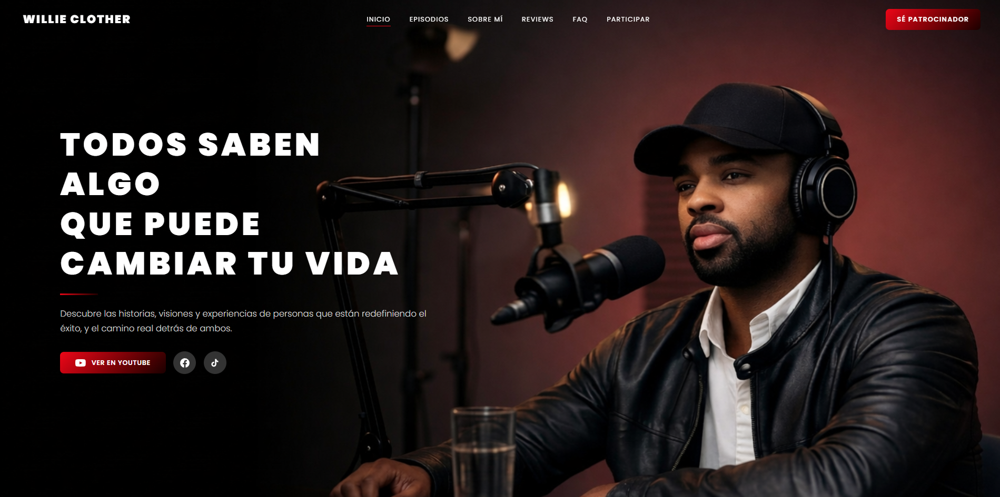

# Willie Clother — Sitio Oficial del Podcast



> **"Todos saben algo que puede cambiar tu vida."**

Sitio web oficial del podcast **Willie Clother**, un espacio de entrevistas profundas con emprendedores, líderes y creadores desde San Pedro Sula, Honduras. Cada episodio explora historias reales con herramientas prácticas para la evolución personal y profesional.

**Live:** [willieclother.netlify.app](https://willieclother.netlify.app)

---

## Secciones

- **Hero** — Presentación principal con acceso directo al canal de YouTube
- **Episodios Recientes** — Videos cargados dinámicamente desde la YouTube API (filtrando Shorts automáticamente)
- **Sobre Mí** — Historia y filosofía detrás del podcast
- **El Podcast en Números** — Métricas reales obtenidas en tiempo real desde la YouTube API
- **Patrocinadores** — Marcas aliadas al proyecto
- **Lo que dice la Comunidad** — Testimonios de oyentes
- **FAQ** — Preguntas frecuentes en formato acordeón
- **Participar** — Formulario de contacto para invitados y marcas
- **Newsletter** — Suscripción a lista de correo

---

## Stack Técnico

| Categoría | Tecnología |
|---|---|
| Framework | React 19 + TypeScript |
| Build tool | Vite 8 |
| Estilos | Tailwind CSS 4 + CSS Modules |
| Formularios | EmailJS |
| Newsletter | Brevo API |
| Videos | YouTube Data API v3 |
| Analytics | Google Analytics 4 |
| Deploy | Netlify |

---

## Arquitectura

```
src/
├── components/        # Un componente por sección + su CSS colocado
│   ├── Navbar.tsx
│   ├── Hero.tsx
│   ├── RecentEpisodes.tsx
│   ├── Sponsors.tsx
│   ├── SponsorModal.tsx
│   ├── SobreMi.tsx
│   ├── Metricas.tsx
│   ├── Resenas.tsx
│   ├── NecesitasSaber.tsx
│   ├── Participar.tsx
│   └── Footer.tsx
├── hooks/
│   ├── useYoutubeVideos.ts   # Fetch y filtrado de episodios
│   ├── useChannelStats.ts    # Métricas del canal en tiempo real
│   └── useInView.ts          # IntersectionObserver para animaciones
├── utils/
│   └── youtube.ts            # Utilidades compartidas de la YouTube API
└── assets/                   # Imágenes y recursos estáticos
```

---

## Funcionalidades destacadas

**Filtrado inteligente de Shorts**
La YouTube API no distingue nativamente entre videos largos y Shorts. El hook `useYoutubeVideos` pagina la playlist completa y filtra por duración y hashtags (`#shorts`) para mostrar solo episodios reales. La misma lógica se usa en `useChannelStats` para el conteo de episodios.

**Métricas en tiempo real**
El componente de métricas consulta la YouTube API al cargar la página y muestra suscriptores, vistas totales, episodios (sin Shorts) y años de actividad calculados desde la fecha de creación del canal.

**Animaciones de scroll**
Hook `useInView` basado en `IntersectionObserver` nativo — sin dependencias externas. Cada sección anima su entrada con `fade-up`, `fade-left` o `fade-right` al hacer scroll, disparándose una sola vez.

**Formulario de participación**
Integrado con EmailJS. Envía los datos del formulario a múltiples destinatarios configurados en variables de entorno, con validación de email en el cliente.

---

## Variables de entorno

Crea un archivo `.env` en la raíz con:

```env
VITE_YOUTUBE_API_KEY=tu_api_key
VITE_EMAILJS_SERVICE_ID=tu_service_id
VITE_EMAILJS_TEMPLATE_ID=tu_template_id
VITE_EMAILJS_PUBLIC_KEY=tu_public_key
VITE_EMAILJS_TO_EMAILS=correo1@gmail.com,correo2@gmail.com
VITE_BREVO_API_KEY=tu_api_key
VITE_BREVO_LIST_ID=tu_list_id
```

---

## Desarrollo local

```bash
# Instalar dependencias
npm install

# Servidor de desarrollo
npm run dev

# Build de producción
npm run build

# Preview del build
npm run preview
```

---

## Deploy

El sitio se despliega automáticamente en **Netlify** al hacer push a `main`. Las variables de entorno deben configurarse en el panel de Netlify en **Site Settings → Environment Variables**.

---

Desarrollado por [Esdras Clother](mailto:esdras.clother@outlook.com)
